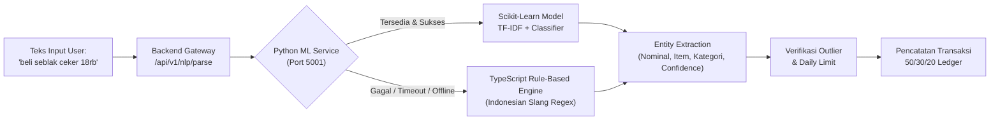

# costKu / Personal Finance Advisor

<div align="center">
  
  <p><strong>Aplikasi Penasihat Keuangan Personal Cerdas untuk First-Jobber & Pekerja Muda Indonesia</strong></p>
  <p><em>Berbasis Filosofi Swiss Design, Algoritma Safe-to-Spend Adaptif, Deteksi Anomali Outlier, dan Hybrid NLP + Machine Learning</em></p>
</div>

---

## 📌 Daftar Isi

1. [Tentang costKu](#-tentang-costku)
2. [Fitur Unggulan](#-fitur-unggulan)
3. [Arsitektur Sistem & Direktori](#-arsitektur-sistem--direktori)
4. [Prasyarat Sistem](#-prasyarat-sistem)
5. [Cara Menjalankan via Docker Compose](#-cara-menjalankan-menggunakan-docker-compose)
6. [Cara Menjalankan Secara Lokal (Development)](#-cara-menjalankan-secara-lokal-development)
7. [Variabel Lingkungan (.env)](#-variabel-lingkungan-env)
8. [Database & Skema Supabase](#-database--skema-supabase)
9. [Hybrid NLP & ML Microservice](#-hybrid-nlp--ml-microservice)
10. [Keamanan & Autentikasi](#-keamanan--autentikasi)
11. [Model Freemium & Pembayaran Midtrans](#-model-freemium--pembayaran-midtrans)
12. [Daftar Endpoint API Utama](#-daftar-endpoint-api-utama)
13. [Pengujian (Testing & QA)](#-pengujian-testing--qa)

---

## 💡 Tentang costKu

**costKu** adalah aplikasi manajemen finansial personal modern yang dirancang khusus untuk memenuhi dinamika keuangan pekerja muda dan *first-jobber* di Indonesia. Menggabungkan estetika **Swiss Design** yang minimalis, tajam, dan bebas distraksi, costKu bertindak lebih dari sekadar pencatat uang (*money tracker*) — costKu adalah **Financial Advisor cerdas** yang menjaga arus kas Anda tetap aman hingga hari gajian berikutnya.

### Masalah Finansial yang Diselesaikan:
- **Sindrom Gaji Numpang Lewat**: Uang habis di awal bulan tanpa disadari karena tidak adanya kalkulasi limit harian.
- **Beban Sewa & Cicilan Berlebihan**: Pengeluaran sewa tempat tinggal (kost) atau cicilan utang yang menggerus pos kebutuhan harian.
- **Pencatatan yang Rumit**: Malas mencatat manual satu per satu karena form yang panjang (diatasi dengan Input Cepat Bahasa Alami / NLP).
- **Pengeluaran Impulsif Tak Terdeteksi**: Belanja berlebihan tanpa peringatan dini dampak terhadap sisa anggaran harian (*Outlier Detection*).

---

## ✨ Fitur Unggulan

### 1. Kalkulator Safe-to-Spend & Daily Limit Adaptif
- **Limit Pengeluaran Harian Otomatis**: Menghitung jatah belanja harian aman berdasarkan sisa hari menuju gajian berikutnya.
- **Daily Rollover Logic**: Sisa limit yang tidak terpakai hari ini otomatis terakumulasi ke hari esok. Jika overbudget, sisa limit hari berikutnya disesuaikan secara proporsional.
- **Split Budget Amortization**: Pembelian bernilai besar (misalnya belanja bulanan atau stok kebutuhan) dapat diamortisasi / dibagi rata ke beberapa hari ke depan agar limit harian tidak jebol.

### 2. Multi-Source Income Management (`/pemasukan`)
- Pencatatan ragam sumber pendapatan: Gaji Pokok, Freelance/Side Hustle, Bisnis, Investasi, Dividen, hingga Insidental/THR.
- Frekuensi fleksibel: Bulanan, Mingguan, Harian, atau Sekali Terima (*One-time*).
- Kalkulasi otomatis total pendapatan bersih sebagai fondasi alokasi 50/30/20 dan Safe-to-Spend.

### 3. Liabilities & Debt Tracking (`/cicilan`)
- Pengelolaan utang dan liabilitas terstruktur: KPR, Cicilan Kendaraan, Pinjol Legal, Kartu Kredit, Paylater, hingga Pinjaman Pribadi.
- Pelacakan tenor, tanggal jatuh tempo, sisa pinjaman, dan nominal cicilan per bulan.
- Otomatis memotong pos liabilitas dari pendapatan sebelum dialokasikan ke kebutuhan operasional harian.

### 4. Deteksi Pengeluaran Anomali (*Outlier Detection*)
- Analisis statistik *Interquartile Range* (IQR) dan batas ambang absolut (mis. transaksi tunggal > 80% pemasukan).
- **Modal Peringatan Interaktif (Outlier Warning)** sebelum transaksi disimpan, mencegah pembelian impulsif yang merusak rencana keuangan.

### 5. Input Transaksi Bahasa Alami (Hybrid NLP + Classical ML)
- Pencatatan transaksi secepat mengetik pesan chat Indonesia:
  - *"Beli seblak ceker pedas 18rb"* ➔ Kategori: Makanan & Minuman (`WANTS`), Nominal: `Rp18.000`
  - *"Kopi kenangan 28k"* ➔ Kategori: Kopi/Jajan (`WANTS`), Nominal: `Rp28.000`
  - *"Bayar kos bulanan 1.3jt"* ➔ Kategori: Tempat Tinggal (`NEEDS`), Nominal: `Rp1.300.000`
  - *"Bensin pertamax 50rb"* ➔ Kategori: Transportasi (`NEEDS`), Nominal: `Rp50.000`
- **Dual-Engine Hybrid**: Engine ML Scikit-Learn TF-IDF di microservice Python dengan fallback otomatis tanpa jeda ke TypeScript Regex Rule-Based Parser.

### 6. Alokasi 50/30/20 Adaptif & Plafon Kost 25%
- Pemisahan ketat antara Kebutuhan (*Needs*), Keinginan (*Wants*), dan Tabungan/Investasi (*Savings*).
- **Plafon Kost Maksimal 25%**: Peringatan tegas jika biaya sewa kost melebihi 25% dari total pemasukan aktif.
- **Smart Minimarket & Nutrition Guide**: Rekomendasi belanja kebutuhan pokok bergizi dengan efisiensi harga terbaik.
- **Financial Health Score (0–100)**: Indikator kesehatan finansial secara berkala.

---

## 🏛️ Arsitektur Sistem & Direktori

Proyek ini dibangun menggunakan arsitektur microservices ringan berbasis 3 komponen utama:

```text
Finace Advisor/
├── frontend/                         # Frontend Application (React 19 + TypeScript + Vite)
│   ├── public/                       # Favicon (ico/png) & Brand Assets
│   ├── src/
│   │   ├── assets/                   # Vector & Raster Brand Logos
│   │   ├── components/               # Layout, Navigation, DailyLimitCard, Forms, Charts, OutlierWarning
│   │   ├── contexts/                 # AuthContext & SubscriptionContext
│   │   ├── data/                     # Data rekomendasi minimarket, kost & gizi
│   │   ├── lib/                      # Budget Engine, Safe-to-Spend formula, API clients, Password Strength
│   │   ├── pages/                    # LandingPage, AuthPage, AuthCallbackPage, OtpVerifyPage, Onboarding,
│   │   │                             # DashboardPage, IncomesPage, LiabilitiesPage, AllocationPage,
│   │   │                             # RecommendationsPage, TransactionsPage, SubscriptionPage
│   │   └── styles/                   # Swiss Design System (auth.css, layout.css, responsive.css, etc.)
│   ├── Dockerfile                    # Multi-stage production build (Node.js Alpine -> Nginx Alpine)
│   └── package.json
│
├── backend/                          # Backend API Gateway (Node.js + Express + TypeScript)
│   ├── src/
│   │   ├── lib/                      # Login Limiter, Password Strength, Midtrans Snap, Supabase Admin
│   │   ├── middleware/               # Auth Guard, Optional Auth, Error Handlers
│   │   ├── modules/
│   │   │   ├── jobs/                 # Cron / Background schedulers (Liability auto-deduct)
│   │   │   ├── nlp/                  # Hybrid NLP Engine (ML Client, Regex Parser, Lexicons)
│   │   │   ├── otp/                  # OTP Security Engine (Crypto, Limiter, Mailer, Storage)
│   │   │   └── outlier/              # Outlier statistical engine & services
│   │   ├── routes/                   # auth, googleAuth, incomes, liabilities, nlp, subscription, midtrans
│   │   └── index.ts                  # Server entrypoint
│   ├── supabase/                     # Skema SQL database Supabase:
│   │   ├── schema.sql                # Subscriptions & base ledger
│   │   ├── otp_schema.sql            # Profiles, OTP tokens, RLS, audit logs & cleanup RPC
│   │   ├── incomes_schema.sql        # Multi-source income tables & policies
│   │   ├── liabilities_schema.sql    # Debts, loans & payment schedules
│   │   ├── split_budget_schema.sql   # Split budget multi-day amortization
│   │   └── nlp_transaction_schema.sql# Dictionaries, NLP logs & user correction training feedback
│   ├── test/                         # Suite pengujian unit & integrasi (170+ tests passing)
│   ├── Dockerfile                    # Container backend production Node.js Alpine
│   └── package.json
│
├── ml-service/                       # Microservice Klasifikasi Transaksi ML (Python + Flask)
│   ├── app.py                        # REST API endpoints (/predict, /retrain, /health)
│   ├── train.py                      # Pipeline TF-IDF Vectorizer + Scikit-Learn Classifier
│   ├── dataset.py                    # Dataset latih teks transaksi bahasa Indonesia
│   ├── model/                        # Serialized pre-trained model artifact (joblib + metadata)
│   ├── Dockerfile                    # Python Alpine container
│   └── requirements.txt              # Flask, Flask-CORS, scikit-learn, joblib, numpy
│
├── docker-compose.yml                # Orkestrasi 3 kontainer terpadu
├── CARA-JALANIN-OTP.md               # Panduan teknis pengujian & setup OTP
├── SETUP-GOOGLE-LOGIN.md             # Panduan integrasi Google Cloud OAuth 2.0
├── screenshot_nlp.png                # Contoh visual input transaksi NLP
└── README.md                         # Dokumentasi panduan utama proyek
```

---

## 📋 Prasyarat Sistem

Sebelum memulai, pastikan perangkat Anda telah terpasang:
- **Node.js**: Versi `18.x` atau `20.x+` & **npm**
- **Python**: Versi `3.10` atau `3.11` (jika ingin menjalankan `ml-service` lokal tanpa Docker)
- **Docker & Docker Compose**: (jika ingin menjalankan semua service dalam kontainer)
- **Git**

---

## 🐳 Cara Menjalankan Menggunakan Docker Compose

Docker Compose mengorkestrasikan ketiga service (`frontend`, `backend`, dan `ml-service`) ke dalam jaringan internal terisolasi secara otomatis.

### 0. Siapkan Environment Variable

Buat file `.env` di **root direktori** (sejajar dengan `docker-compose.yml`):
```env
VITE_SUPABASE_URL=https://your-project.supabase.co
VITE_SUPABASE_ANON_KEY=eyJhbGciOiJIUzI1NiIsInR5cCI6IkpXVCJ9...
VITE_BACKEND_URL=http://localhost:5000
```
> **Catatan Penting:** Variabel `VITE_*` di-inject ke dalam file JavaScript statis saat build Nginx frontend. Jika belum memiliki Supabase riil, Anda tetap dapat mengisi URL placeholder karena sistem dilengkapi **Graceful Offline / Demo Mode**.

Pastikan file `backend/.env` juga sudah disiapkan (lihat bagian [Variabel Lingkungan](#-variabel-lingkungan-env)).

### 1. Build & Jalankan Seluruh Container
```bash
docker compose up -d --build
```

### 2. Periksa Status Service
```bash
docker compose ps
```
Pastikan ketiga container berada dalam status `Up`:
- `costku_frontend` (Port `80`)
- `costku_backend` (Port `5000`)
- `costku_ml_service` (Port `5001`)

### 3. Akses Aplikasi
- **Frontend Web App**: Buka browser di [http://localhost](http://localhost) (Port 80)
- **Backend API Gateway**: [http://localhost:5000](http://localhost:5000)
- **ML Microservice Health**: [http://localhost:5001/health](http://localhost:5001/health)

### 4. Periksa Log Container
```bash
# Log seluruh container
docker compose logs -f

# Log service spesifik
docker compose logs -f backend
docker compose logs -f ml-service
docker compose logs -f frontend
```

### 5. Menghentikan Container
```bash
docker compose down
```

---

## 💻 Cara Menjalankan Secara Lokal (Development)

Untuk lingkungan pengembangan lokal dengan hot-reload:

### 1. Jalankan ML Microservice (Port 5001)
```bash
cd ml-service

# Buat virtual environment
python -m venv venv

# Aktivasi virtual environment
# Windows:
.\venv\Scripts\activate
# Linux/macOS:
source venv/bin/activate

# Install dependensi & latih model
pip install -r requirements.txt
python train.py

# Jalankan server Flask
python app.py
```
Akses di: `http://localhost:5001/health`

### 2. Jalankan Backend (Port 5000)
Buka terminal baru:
```bash
cd backend
npm install
npm run dev
```
Akses di: `http://localhost:5000`

### 3. Jalankan Frontend (Port 5173)
Buka terminal baru:
```bash
cd frontend
npm install
npm run dev
```
Akses di: `http://localhost:5173`

### 4. Perintah Cepat dari Root Workspace
```bash
# Install seluruh dependensi frontend dan backend sekaligus
npm run install:all

# Menjalankan frontend dev server
npm run dev:frontend

# Menjalankan backend dev server
npm run dev:backend

# Menjalankan test suite backend
npm test --prefix backend
```

---

## 🔐 Variabel Lingkungan (.env)

### 1. Frontend (`frontend/.env`):
```env
VITE_SUPABASE_URL=https://your-project.supabase.co
VITE_SUPABASE_ANON_KEY=eyJhbGciOiJIUzI1NiIsInR5cCI6IkpXVCJ9...
VITE_BACKEND_URL=http://localhost:5000
```

### 2. Backend (`backend/.env`):
```env
PORT=5000
NODE_ENV=development
FRONTEND_URL=http://localhost:5173

# ML Service endpoint
ML_SERVICE_URL=http://localhost:5001

# Supabase Admin / Service Role
SUPABASE_URL=https://your-project.supabase.co
SUPABASE_SERVICE_ROLE_KEY=your_service_role_key
SUPABASE_ANON_KEY=your_anon_key

# Keamanan OTP
OTP_PEPPER=ganti-dengan-secret-acak-panjang-min-32-karakter
# OTP_DEV_FIXED_CODE=123456  # Opsional: pin kode di lokal dev

# SMTP Email (Pengiriman Kode OTP)
# Jika dikosongkan pada mode development, kode OTP akan dicetak rapi di console
SMTP_HOST=smtp.gmail.com
SMTP_PORT=465
SMTP_USER=your_email@gmail.com
SMTP_PASS=your_app_password
SMTP_FROM="costKu Security <no-reply@costku.id>"

# Google OAuth 2.0 (Authorization Code Flow)
GOOGLE_CLIENT_ID=your_client_id.apps.googleusercontent.com
GOOGLE_CLIENT_SECRET=your_client_secret
GOOGLE_REDIRECT_URI=http://localhost:5000/api/v1/auth/google/callback

# Midtrans Payment Gateway
MIDTRANS_SERVER_KEY=SB-Mid-server-xxxxxx
MIDTRANS_CLIENT_KEY=SB-Mid-client-xxxxxx
MIDTRANS_IS_PRODUCTION=false
```

---

## 🗄️ Database & Skema Supabase

costKu memanfaatkan PostgreSQL Supabase dengan Row Level Security (RLS) terisolasi per `user_id`. Untuk inisialisasi tabel, jalankan skrip berikut di **Supabase SQL Editor** sesuai urutan:

1. **`backend/supabase/schema.sql`**  
   Membuat tabel `subscriptions` dan relasi dasar akun premium.
2. **`backend/supabase/otp_schema.sql`**  
   Membuat tabel `profiles`, `otp_codes`, trigger auto-profile, RLS, dan RPC pembersihan berkala (`clean_expired_otps`).
3. **`backend/supabase/incomes_schema.sql`**  
   Membuat tabel `incomes` untuk multi-source pendapatan (gaji, freelance, dividen) beserta trigger update timestamp dan RLS.
4. **`backend/supabase/liabilities_schema.sql`**  
   Membuat tabel `liabilities` untuk pelacakan cicilan, bunga, sisa pinjaman, dan RLS.
5. **`backend/supabase/split_budget_schema.sql`**  
   Menambahkan kolom amortisasi pada transaksi belanja multi-hari (`is_split_budget`, `split_days`, `daily_amortized_amount`).
6. **`backend/supabase/nlp_transaction_schema.sql`**  
   Menyediakan kamus istilah gaul/slang Indonesia, data merek produk minimarket, log parsing transaksi, dan tabel koreksi user untuk retraining model ML.

> **Graceful Degradation**: Jika Supabase belum dikonfigurasi, backend dan frontend otomatis berjalan dalam **Mode Demo / LocalStorage**, sehingga UI dan seluruh simulasi fitur tetap dapat dievaluasi penuh tanpa hambatan konfigurasi database.

---

## 🧠 Hybrid NLP & ML Microservice

Sistem pengenalan transaksi natural costKu menggunakan pendekatan **Hybrid Dual-Engine**:



1. **Python ML Microservice (`ml-service`)**:
   - Model klasifikasi teks berbasis **TF-IDF n-gram (1-2) Vectorizer** + **Linear/SGD Classifier** terlatih pada korpus kosakata belanja sehari-hari Indonesia.
   - Mengembalikan label kategori, probabilitas distribusi, dan derajat keyakinan (*confidence score*).
2. **Deterministic Rule-Based Fallback**:
   - Mengekstrak nominal uang dengan berbagai format Indonesia (`15k`, `15rb`, `1.5jt`, `Rp 25.000`, `sepuluh ribu`).
   - Normalisasi kata slang (`bensin`, `ngopi`, `laundry`, `listrik`, `indomaret`, `alfamart`).
3. **Active Feedback Loop**:
   - Koreksi kategori oleh user dikirimkan ke endpoint `/api/v1/nlp/correct` untuk memperkaya dataset.
   - Endpoint `/retrain` pada ML service melatih ulang model secara instan tanpa perlu mematikan container.

---

## 🛡️ Keamanan & Autentikasi

costKu mengimplementasikan standar keamanan perbankan untuk melindungi akun pengguna:

- **Password Strength Enforcement**: Validasi ketat kata sandi (minimal 8 karakter, kombinasi huruf besar, huruf kecil, angka, dan karakter khusus) dengan meter visual interaktif pada form registrasi.
- **Proteksi Brute-Force & Account Lockout**:
  - Pelacakan percobaan login gagal secara terpusat (`loginLimiter.ts`).
  - Maksimal 5 percobaan gagal berturut-turut akan mengunci akun selama **15 menit**.
  - Tampilan hitung mundur (*lockout countdown timer*) real-time di antarmuka pengguna.
- **Autentikasi OTP Tanpa Replay**:
  - Dihasilkan via *Cryptographically Secure Pseudorandom Number Generator* (CSPRNG).
  - Disimpan dalam bentuk **HMAC-SHA256 hash** menggunakan *secret pepper* server.
  - Berlaku 5 menit, *single-use token* (otomatis hangus saat diverifikasi), dan cooldown 60 detik untuk permintaan ulang (*resend*).
  - Panduan lengkap verifikasi OTP: [CARA-JALANIN-OTP.md](file:///c:/Users/SANRIO/Downloads/Finace%20Advisor/CARA-JALANIN-OTP.md).
- **Google OAuth 2.0**:
  - Menggunakan *Server-Side Authorization Code Flow* dengan parameter `state` terenkripsi HMAC anti-CSRF.
  - Panduan integrasi Google: [SETUP-GOOGLE-LOGIN.md](file:///c:/Users/SANRIO/Downloads/Finace%20Advisor/SETUP-GOOGLE-LOGIN.md).

---

## 💳 Model Freemium & Pembayaran Midtrans

| Fitur | Mode Free (Money Tracker) | Mode Premium (Financial Advisor) |
|---|:---:|:---:|
| Pencatatan transaksi harian & riwayat | ✅ Gratis Selamanya | ✅ Lengkap |
| Input cepat transaksi via Hybrid NLP | ✅ Aktif | ✅ Aktif |
| Filter & ringkasan arus kas | ✅ Gratis Selamanya | ✅ Lengkap |
| Multi-Source Income Management | 🔒 Terbatas (1 Sumber) | ✅ Pemasukan Berganda Tanpa Batas |
| Liabilities & Debt Management | 🔒 Terkunci | ✅ Pelacakan Tenor & Cicilan Lengkap |
| Kalkulator Safe-to-Spend Adaptif | 🔒 Terkunci | ✅ Live Sync Harian |
| Split Budget Amortization (Multi-Hari) | 🔒 Terkunci | ✅ Aktif |
| Outlier Detection & Prevention Alert | 🔒 Terkunci | ✅ Deteksi Anomali Real-Time |
| Rekomendasi Kost (Maks 25% Pendapatan) | 🔒 Terkunci | ✅ Aktif dengan Rekomendasi Area |
| Rekomendasi Belanja Minimarket & Gizi | 🔒 Terkunci | ✅ Aktif |
| Financial Health Score (0–100) | 🔒 Terkunci | ✅ Analisis Komprehensif |
| Integrasi Pembayaran Midtrans Snap | — | ✅ QRIS, VA Bank, GoPay, ShopeePay |

---

## 🔌 Daftar Endpoint API Utama

### 1. Autentikasi & Akun (`/api/v1/auth`)
| Method | Endpoint | Deskripsi |
|---|---|---|
| `POST` | `/api/v1/auth/register` | Pendaftaran akun baru, validasi kata sandi, & penerbitan OTP |
| `POST` | `/api/v1/auth/register/verify-otp` | Verifikasi kode OTP 6-digit & aktivasi akun ke status `ACTIVE` |
| `POST` | `/api/v1/auth/register/resend-otp` | Pengiriman ulang kode OTP (tunduk pada cooldown 60 detik) |
| `POST` | `/api/v1/auth/login` | Login email & password dengan proteksi lockout & rate limit |
| `GET`  | `/api/v1/auth/google` | Inisiasi login Google OAuth 2.0 |
| `GET`  | `/api/v1/auth/google/callback` | Callback Google OAuth (pertukaran auth code dengan token sesi) |
| `GET`  | `/api/v1/auth/otp/diagnostics` | Cek status kesehatan, mode mailer, dan konfigurasi OTP |

### 2. Natural Language Processing (`/api/v1/nlp`)
| Method | Endpoint | Deskripsi |
|---|---|---|
| `POST` | `/api/v1/nlp/parse` | Parsing teks bebas transaksi menjadi entitas terstruktur via Hybrid ML/Regex |
| `POST` | `/api/v1/nlp/persist` | Parsing sekaligus menyimpan transaksi ke database user |
| `POST` | `/api/v1/nlp/correct` | Kirim koreksi kategori user untuk dataset retraining ML |
| `GET`  | `/api/v1/nlp/info` | Status runtime hybrid NLP & konektivitas ML microservice |

### 3. Pemasukan (`/api/v1/incomes`)
| Method | Endpoint | Deskripsi |
|---|---|---|
| `GET`  | `/api/v1/incomes` | Mengambil seluruh daftar sumber pemasukan aktif user |
| `POST` | `/api/v1/incomes` | Menambahkan sumber pemasukan baru (gaji, freelance, dll.) |
| `PUT`  | `/api/v1/incomes/:id` | Memperbarui data nominal, kategori, atau frekuensi pemasukan |
| `DELETE`| `/api/v1/incomes/:id` | Menghapus sumber pemasukan |

### 4. Liabilitas & Cicilan (`/api/v1/liabilities`)
| Method | Endpoint | Deskripsi |
|---|---|---|
| `GET`  | `/api/v1/liabilities` | Daftar seluruh cicilan & utang aktif user beserta sisa tenor |
| `POST` | `/api/v1/liabilities` | Mencatat utang / cicilan baru |
| `PUT`  | `/api/v1/liabilities/:id` | Update data pinjaman / tenor |
| `POST` | `/api/v1/liabilities/:id/pay` | Catat pembayaran angsuran cicilan |
| `DELETE`| `/api/v1/liabilities/:id` | Menghapus data liabilitas |

### 5. Langganan & Pembayaran (`/api/v1/subscription`, `/api/v1/midtrans`)
| Method | Endpoint | Deskripsi |
|---|---|---|
| `GET`  | `/api/v1/subscription/status` | Cek status tier pengguna (Free vs Premium) |
| `POST` | `/api/v1/subscription/create-transaction` | Membuat transaksi Snap token Midtrans untuk upgrade |
| `POST` | `/api/v1/midtrans/webhook` | Webhook notifikasi pembayaran Midtrans (aktivasi otomatis) |

### 6. ML Microservice Standalone (Port 5001)
| Method | Endpoint | Deskripsi |
|---|---|---|
| `GET`  | `/health` | Memeriksa status service, uptime, dan status model ML |
| `POST` | `/predict` | Prediksi kategori dari teks transaksi beserta derajat probabilitas |
| `POST` | `/retrain` | Memicu training ulang pipeline TF-IDF + Classifier |

---

## 🧪 Pengujian (Testing & QA)

Backend costKu dilengkapi suite pengujian otomatis komprehensif menggunakan native Node.js test runner dan `tsx`:

```bash
cd backend

# Menjalankan seluruh test suite (170+ tests)
npm test

# Menjalankan test modul NLP & hybrid parser
npm run test:nlp

# Menjalankan test modul keamanan OTP, kriptografi & limiter
npm run test:otp
```

### Cakupan Pengujian:
- **Budget Engine**: Split Budget Amortization, Daily Rollover Logic, Carry-Over Balance.
- **Outlier Detection**: Anomali transaksi tunggal >80% pendapatan dan deteksi lonjakan IQR.
- **Keamanan OTP**: Entropi CSPRNG, HMAC-SHA256, Anti-Replay, Single-use guarantees, Cooldown enforcement, Concurrency race-conditions.
- **NLP Parser**: Normalisasi slang bahasa Indonesia, deteksi multi-item guard, disambiguasi konteks darurat, dan integrasi fallback.

---

<div align="center">
  <p>Dikembangkan dengan ❤️ untuk kemerdekaan finansial anak muda Indonesia.</p>
  <p><strong>costKu © 2026</strong> — Minimalist, Adaptive, Secure.</p>
</div>
